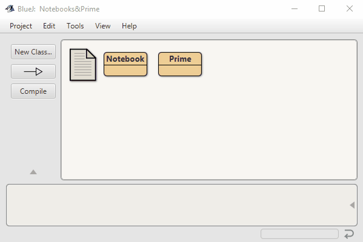

# Lab1.4
Lab 1.4 - A Better Notebook with search engine. 1st semester, 4th lab.

Project: notebook1
Authors: David J. Barnes and Michael Kolling

This project provides a simple notebook implementation.

This project is part of the Java 5 supplementary material for
chapter 4 of the book

   Objects First with Java - A Practical Introduction using BlueJ
   Fourth edition
   David J. Barnes and Michael Kolling
   Pearson Education, 2008

To start this project, create a Notebook object and invoke its methods.

 Notebook class to maintain an arbitrarily long list of notes.
 Notes are numbered for external reference by a human user.
 In this version, note numbers start at 0.
 
 @author David J. Barnes and Michael Kolling.
 @version 2008.03.30
 @updated 2020.12.07 by GitYusuf and n-c0de-r
 
 The class Prime calculates all primes 
 to a certain maximum value.
 
 @author GitYusuf, n-c0de-r
 @version 12/07/20
 
 
