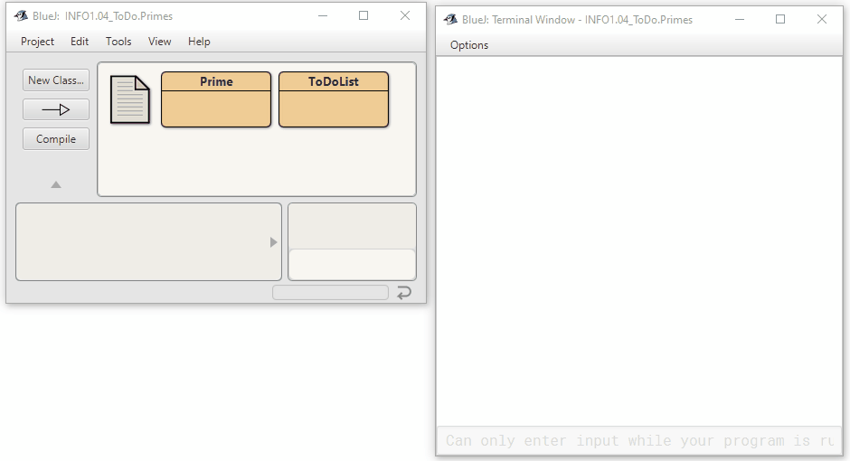
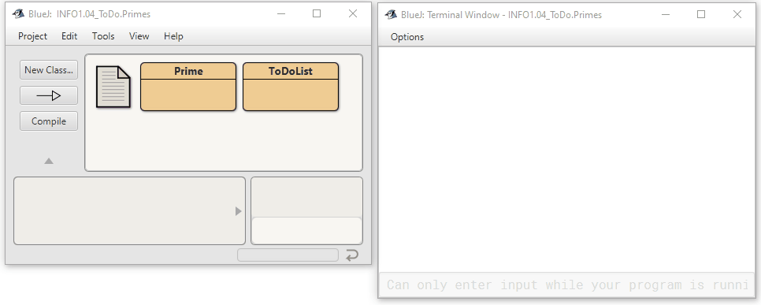

 The ToDo-List class to maintain an arbitrarily long list of tasks.
 Tasks are numbered for external reference by a human user.
 In this version, task numbers start at 0.
 
 Based on the original by David J. Barnes and Michael Kölling
 @author n-c0de-r
 @version 2023.02.06
 
 
 
 The Prime class calculates all primes 
 to a certain given maximum value.
 
 @author n-c0de-r
 @version 2023.02.06
 
 
